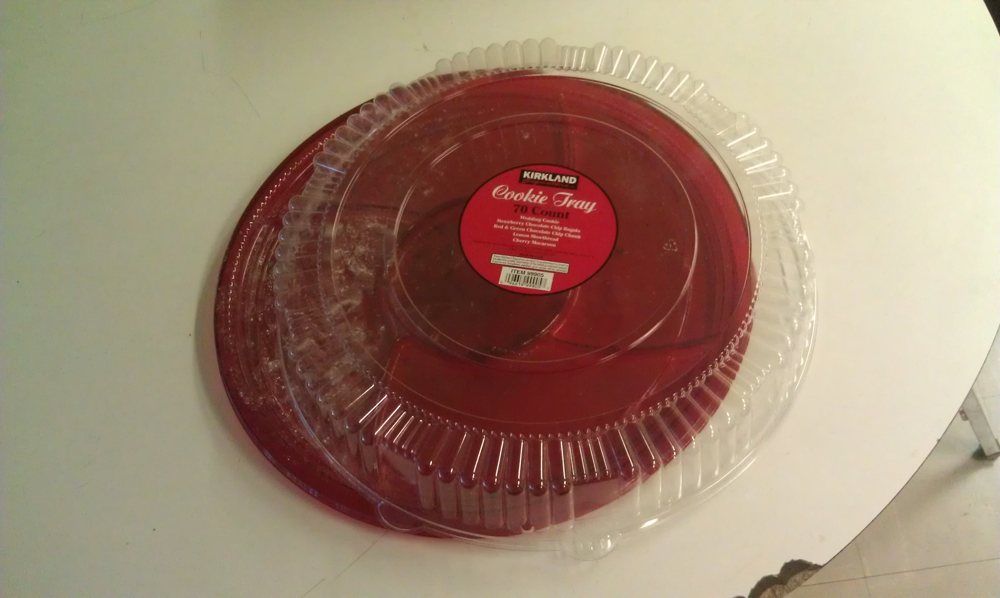

Just pretending it is tomorrow! This one will use a `<CustomImage />` component eventually.

<CustomImage
  src='https://raw.githubusercontent.com/kenfeliciano/blogposts/main/images/you-are-late.jpg'
  alt='You are late and there are no more cookies'
/>

Not a custom image this time! Let's see what happens trying to add an image using Markdown.

This is not working. The image is located in `/blogposts/images` just like in the GitHub. However, it cannot find it specified as `` which I thought would work. Being that I'm currently at the route point `/posts/another` and it is in a subdirectory within this current directory. Yeah, how to do this. I want to use folders eventually.

**Content folder**

- `index.mdx` - the actual content
- images of all sorts that live in the post, including the eventual cover image (which I think would be easier)

But I got distracted! I wasn't supposed to be working on images. I was supposed to be making this site work in `dev` with local versions of the `blogposts` and in `prod` with the GitHub repo and I did!
